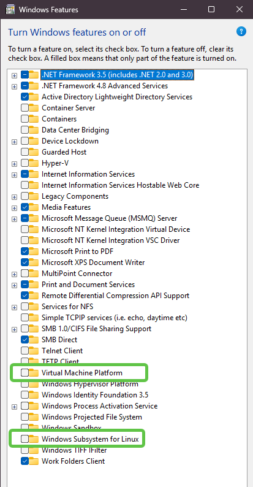
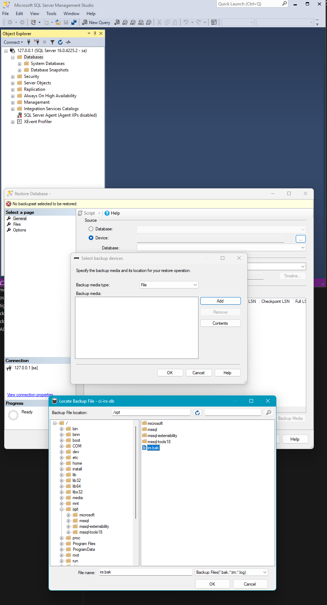

# Podman

## Install

### 1. Uninstall Everything First
1. Uninstall Docker
2. If Windows Subsystem for Linux is enabled remove all the distributions,
   - Terminal: `wsl --list`
   - Terminal: `wsl --unregister <DistroName>`
1. 
3. Remove Podman machines if necessary `podman machine rm`
4. Uninstall Podman
5. Uninstall Podman Desktop
6. Disable **Windows Subsystem for Linux** (WSL) and **Virtual Machine Platform**.  
   Open **Windows Features** by searching for "turn windows features on or off"  
   in the start menu
   
7. Remove your normal user from administrator group if you have added yourself to  
   the administrator group (Powershell as admin, type `mmc`, add plugin, **Local Users...**, etc.)

### 2. Downloads
1. Go to [Podman Releases] and download the latest `podman-n.n.n-setup.exe`
2. Go to [podman desktop] and download the latest podman desktop for windows, this  
   will be something like `podman-desktop-1.23.1-setup-x64.exe`

### 3. Install Podman
1. Double click `podman-n.n.n-setup.exe` (install for all users if asked)
1. After step 1, open **Terminal** and run `podman machine init`, say yes to  
   everything, let you PC restart, and wait for about 5 minutes for the install  
   to finish
1. After all that open terminal if it isn't already opened for you and run:  
   `podman machine start`

### 4. Install Podman Desktop
1. Double click `podman-desktop-1.23.1-setup-x64.exe`
2. Install for all users if asked

### 5. SQL Server
```sh
podman pull --tls-verify=false mcr.microsoft.com/mssql/server:2022-latest

podman run `
    -e "ACCEPT_EULA=Y" `
    -e "MSSQL_SA_PASSWORD=your password here (1 Capital, 1 Lowercase, 1 Special, 1 Number, At least 8 characters)" `
    -p 1433:1433 `
    --name ci-irs `
    --hostname ci-irs `
    -d mcr.microsoft.com/mssql/server:2022-latest


podman run `
    -e "ACCEPT_EULA=Y" `
    -e "MSSQL_SA_PASSWORD=P@ssword1" `
    -p 1433:1433 `
    --name ci-irs-db `
    --hostname ci-irs-db `
    -d mcr.microsoft.com/mssql/server:2022-latest
```

<!-- Password = "P@ssword1" -->

start both things machine and sql image

copy a .bak to c:\.wsl\irs.bak

```sh
podman machine ssh
podman cp /mnt/c/.wsl/irs.bak ci-irs-db:opt
```
this copies the .bak to the root ("/")
:opt = /opt

Restore Database


Step **5** Concludes the Installation of Podman


[Podman for Windows]: https://github.com/containers/podman/blob/main/docs/tutorials/podman-for-windows.md
[Podman Releases]: https://github.com/containers/podman/releases
[podman desktop]: https://podman-desktop.io/