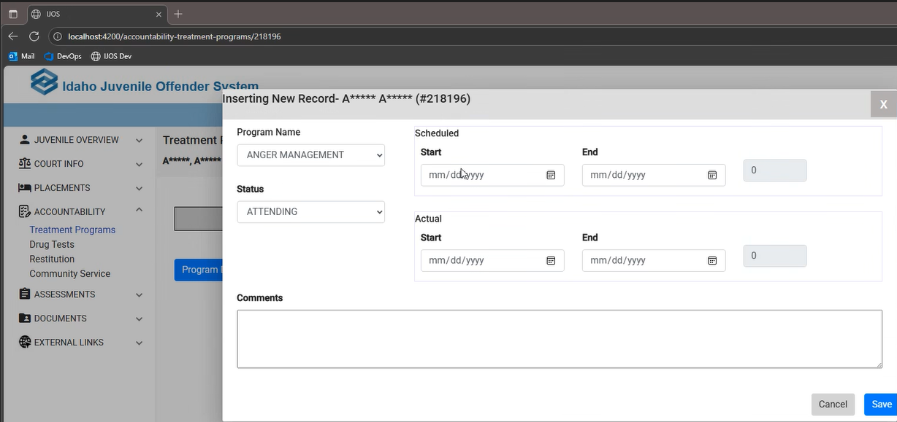

Ijos > ACCOUNTABILITY > Treatment Programs > New Record

- Update insert a new treatment record to use [Owl] date time control.
- So loading a new treatment screen, there is an error thrown in javascript with the date diff function.
- 500 error when trying to save a new treatment.  Chose anger management, attending status, and a start date, and comment.
- Program details should show all programs, but it is giving a 500 error.
- Offender 3321 - grid loads, but clicking on edit gives a 500 error.
- Trying to delete a treatment program gives a 500.

[Owl]: https://daniel-projects.firebaseapp.com/owlng/date-time-picker