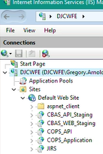

# CBAS

## Project Structure
### IDJC.Web
#### Third Party Library
- Bogus (`SeedData.cs`)

## Local Development
Use Developer edition of Sql Server

## Server  

`web.config` is managed in the server, ***not* in code**

  

### Sites
`C:\Websites\`  
- CBAS_stage (`staging`)  
- COPS_applicaiton (`production`)  
   

Passwords
App -> Configuration Editor -> environmentVariables -> ...
Double Underscores is used to navigate into a JSON object

## Scripts

### Location
`C:\Scripts\`  

| Name                                     | Schedule |
| :--------------------------------------- | :------- |
| `CBAS_ExpiredRequests_AutoClose.ps1`     |          |
| `CBAS_ExpiredRequests_Notifications.ps1` |          |

These are deployed to the server, and the Api Keys are manually added to the  
scripts

### ...AutoClose.ps1
**Windows Task Scheduler**: AutoCloseExpiredCOPSRequests

### ...Notification.ps1
**Windows Task Scheduler**: 