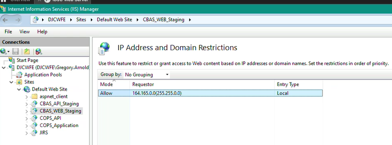
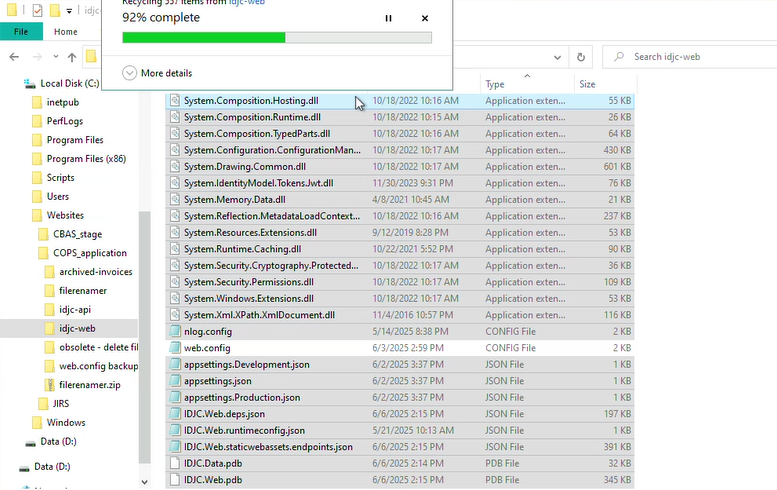
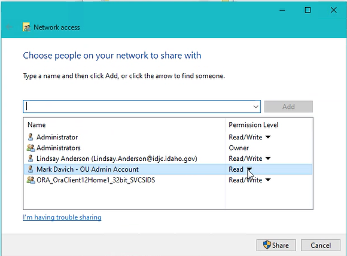

## Server
- `DJCWFE: \Sites\Default Web Site\COPS_API`
- `DJCWFE: \Sites\Default Web Site\COPS_Application`  

### Staging

## Steps
Create backups: 
1. Copy live site folder
   1. [yyyymmdd]-[]

D:\CBAS_Builds  
    [yyyy]... create folder  
        

        artifacts
            [Backups] IIS Server Apps prior to this deployment
            DatabaseChanges.txt 
            ...zip (comes from the build)
            ...sql (any sql scripts that need to be run before deployment)

Delete all but logs and web.config for all apps  
  

## Oracle  
  
  
  
  
  

## Tickets
### Missing Charge
INC0221505

Log into: 164.165.158.58

Email Subject Line: Missing Charge
Error-02291: ORA-02291
Missing statue code
Odyssey need restart

How to resolve the “Missing Charge” error & restart the Odyssey interface
ITS DBA Team will receive an email like the one below:
-----Original Message-----
From: support@ijos.idaho.gov <support@ijos.idaho.gov>
Sent: Tuesday, June 24, 2025 1:24 PM
To: support@ijos.idaho.gov; ITS DBA Team <ITSDBATeam@its.idaho.gov>; ITS APPDEV Team <itsappdev@its.idaho.gov>; HostMaster <hostmaster@idaho.gov>
Subject: Missing Charge....228754
 
/*Error -02291: ORA-02291: Charge: I18-6604AT  ody internal charge ID: 13495188
 
Actual Odyssey code is: I18-6604AT
Type: Felony
Description: Forcible Penetration by Use of Foreign Object (Attempted)*/
 
select * from ijos.ody_missing_statutes m order by m.create_date desc;
 
select * from ijos.ody_statute_code o where o.ody_statute_code like '%I18-6604AT%';
 
select * from ijos.ODY_STATUTE_code o where upper(o.code_description) like '%FORCIBLE PENETRATION BY USE OF FOREIGN OBJECT (ATTEMPTED)%';
 
select * from ijos.idaho_code o where upper(o.statute_code) like upper('%I18-6604AT%');
 
Login to SQLNavigator and connect to IJOS2 database (164.165.156.163)
Copy the text from the email message into a new editor
Remove the leading ‘I’ from the last script and run all 4 scripts
If the final script DOES return a value for the statute code, copy the statue code from the STATUTE If the final script does NOT return a value
 
### Missing Rooms
INC0222656

Log into: 164.165.158.58

Room Fixes Documentation
* When a room is unavailable for the user to assign to a juvenile being booked into the facility, the issue is that a previously released juvenile did not populate the "end date" for that room, and it is still being listed as unavailable (not vacant).
* Oracle tables to look at, depending on the problem are:
	* Actual_Location_Hist
	* Room_Assignments
	* Facility_Rooms
Steps to resolve:
* Open RoomFixes.sql file
 
A. If a room is unavailable to assign to a juvenile use this query:  select * from ijos.facility_rooms f where f.facility_name_2 = '[FACILITY_NAME_2]';
	i.  Locate the specific room and if VACANT = F, change to VACANT = T
		a. update ijos.facility_rooms set vacant = 'T' where facility_name_2 = '[FACILITY_NAME_2]' and room_number_2 = '[ROOM_NUMBER_2';
	ii. Locate the last juvenile to occupy that room and make sure the DATE_OUT_ROOM is populated
		a. select * from ijos.room_assignments r where r.room_number = '[ROOM_
		]' and r.facility_name = '[FACILITY_NAME_2]' order by r.date_out_room desc;
	iii. Use the ACTUAL_LOCATION_HIST_ID (from the query above) to find the specific IJOS#
		a. SELECT * FROM IJOS.actual_location_hist AL WHERE AL.actual_location_hist_id = ACTUAL_LOCATION_HIST_ID;
	iv. Use the END_DATE value from the query above to update the Room_Assignments table for the specified juvenile's ACTU
		a. update ijos.room_assignments set date_out_room = '04-NOV-2024' where date_out_room is null and room_assignment_id = 107494;

D4DAUDJJ51W13MX1KLR4ZGWMFA7ZC60F2V-156-608-667-F0

IDAHO DEPARTMENT OF JUVENILE CORRECTION

Greg Questions
AutoMapper looks like it is not used
Upgrade Build to minor version

**Program** is entry point

Security

Web Startup
    ConfigureServices
        Data.UserData: IdentityUser
        DefaultUI()

        Identity cookies

        Line 59
        Using file to share cookie,
        we can do this because it is on
        the same server

    wwwroot\app\app.js
        withCredentials

Api Startup
    Allow Credentials cookie comes through Line 48

    Line 68: AuthDBContext

    Line 74: Add AuthDBContext

    Line 83: Using the file

Review rolls for all the API calls