1. Uninsall NVM
2. Install Volta
3. Install correct node version
4. Install .NET 9 Sdk
5. Setup local SQL server
6. SSMS: Import Data-Tier Application... (`ijosscrubbed_0903.bacpac` from share point) SEE: Wiki
7. npm install -g @angular/cli
 


1. [Install NVM] (If not winget) 
   - Look for `nvm-setup.exe` (at the bottom of the page) and download it  
     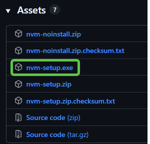  
2. Uninstall Node
3. Install `nvm` using the installer
```sh
winget install --id=CoreyButler.NVMforWindows -e
```
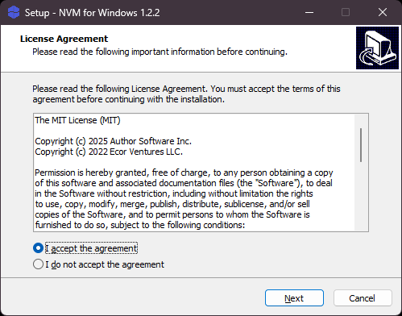  
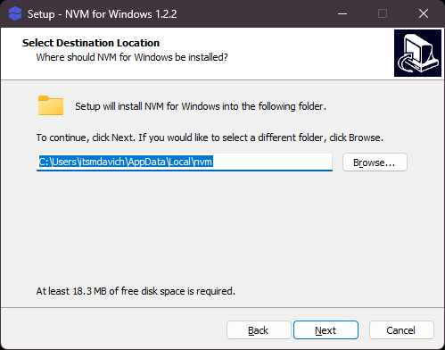  
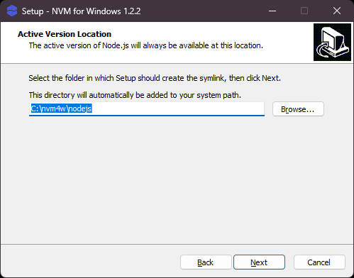  
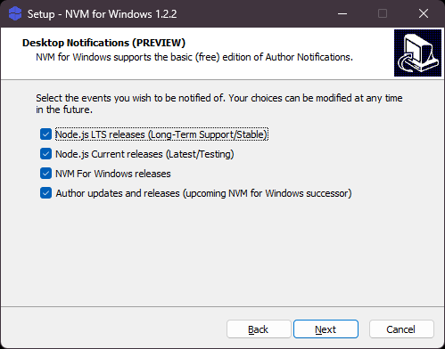  
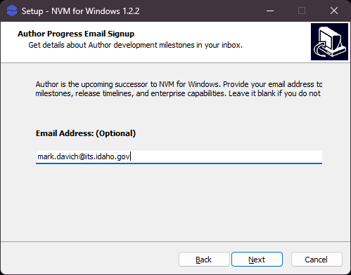  
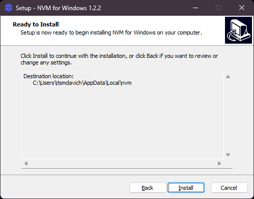  
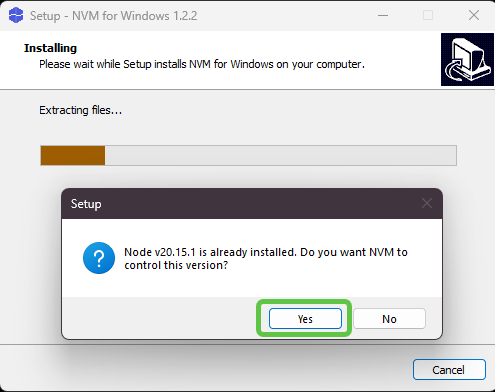  
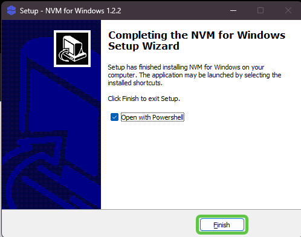  

1. Run the following in **PowerShell**
```sh
nvm install 14.21.3
nvm use 14.21.3
```


```sh
# Run this script in a PowerShell window with admin rights for full cleanup. Some steps will also work as a normal user.

$nvmPaths = @(
    'C:\nvm4w',
    ''
)

# Uninstall nvm-windows if it's still installed
$uninstallPath = "${env:ProgramFiles}\nvm"
if (Test-Path $uninstallPath) {
    Write-Host "Uninstalling nvm-windows..."
    # This assumes the default install path. Adjust if you installed it elsewhere.
    Remove-Item -Recurse -Force $uninstallPath
}

# Remove leftover nvm and nodejs folders
$oldNvmPaths = @(
    "$env:LOCALAPPDATA\nvm",
    "$env:APPDATA\nvm",
    "C:\nvm",          # the new location we’ll use
    "C:\nodejs"       # the new symlink folder
)

foreach ($path in $oldNvmPaths) {
    if (Test-Path $path) {
        Write-Host "Removing $path..."
        Remove-Item -Recurse -Force $path
    }
}

# Check and remove old environment variables
$envVars = @("NVM_HOME", "NVM_SYMLINK")
foreach ($var in $envVars) {
    if (Test-Path "env:$var") {
        Write-Host "Removing user environment variable: $var..."
        [System.Environment]::SetEnvironmentVariable($var, $null, [System.EnvironmentVariableTarget]::User)
    }
    if (Test-Path "env:USERDOMAIN\$var") {
        Write-Host "Removing admin environment variable: $var..."
        [System.Environment]::SetEnvironmentVariable($var, $null, [System.EnvironmentVariableTarget]::Machine)
    }
}

# Clean up PATH from any old nvm or nodejs references
$userPath = [System.Environment]::GetEnvironmentVariable('Path', [System.EnvironmentVariableTarget]::User) -split ';'
$machinePath = [System.Environment]::GetEnvironmentVariable('Path', [System.EnvironmentVariableTarget]::Machine) -split ';'

# Define what to remove
$oldPathEntries = @('C:\nvm', 'C:\nodejs')  # adjust if you used different paths

# Remove from user PATH
$newUserPath = $userPath | Where-Object { $_ -and ($_ -notin $oldPathEntries) }
[System.Environment]::SetEnvironmentVariable('Path', ($newUserPath -join ';'), [System.EnvironmentVariableTarget]::User)

# Remove from machine PATH (requires admin)
$newMachinePath = $machinePath | Where-Object { $_ -and ($_ -notin $oldPathEntries) }
[System.Environment]::SetEnvironmentVariable('Path', ($newMachinePath -join ';'), [System.EnvironmentVariableTarget]::Machine)

Write-Host "Uninstallation and cleanup complete! Please restart your terminal to see the changes."

```

[Install NVM]: https://github.com/coreybutler/nvm-windows/releases/latest
[nvm-setup.exe]


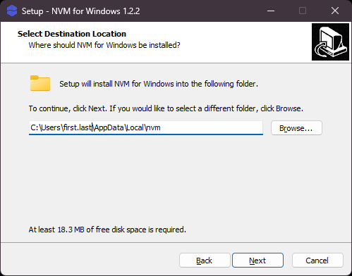
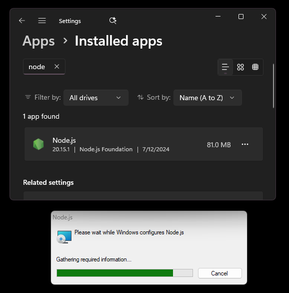