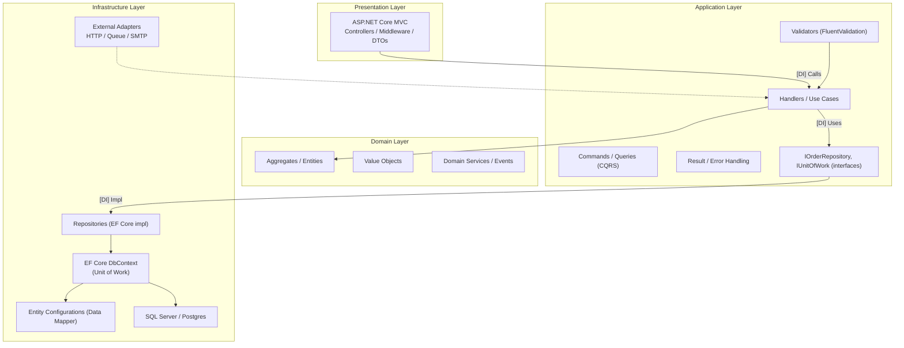
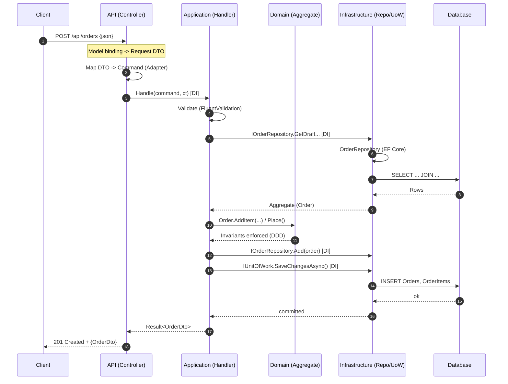

# Clean Architecture (Onion)

## The Onion

## The Sequence

## The Process
First thing, pick an architecture
- Repository (with Service layer [For business logic])
- Clean Architecture
- [Your Architecture Here]

Having an architecture will provide simple locations where code can be extracted

> - Create a `C#` representation of the database in the `Domain` layer (Or an   
>   agency domain package like `Abc.Domain.Models`).
> - Create an **EF Core *Migrations** project, perform initial migration (If using  
>   *Code First* approach)
> - Identify database operations and move them to correct layer
> - Choose how database operations will be performed, **Dapper**, **EF Core**???

### 1. Scaffold Database Into Models

### 2. Identify Database Operations
- Create a **Controller** in the `Presentation` (API) layer for the table, if  
  needed, or if it is an aggregated query, create an appropriate controller like,  
  `AuditReportsController`
- Move SQL to `Infrastructure` layer
- Move **Agency Wide** business rules/logic to the domain layer (or package like  
  `Abc.Domain.BusinessRules`)
- Create `Application` layer objects for the request
  - Business rules
  - Handler for the request
  - 

Each database operation will happen in a `ASP.NET Core WebAPI` call  