# IDeal

- [Ideal Home](https://www.idsaves.org/home.html)
- [Statistics](https://www.idsaves.org/home/price-performance.html)
- IDeal is the Idaho's State Sponsored 529 college savings program
- Established by Idaho Code

## Tax Deductions
- Deduct up to $12, 000 on contributed amount (Married Filing Jointly)
- Contributor is the one who gets the deduction
- While money is growing, we don't pay taxes  
  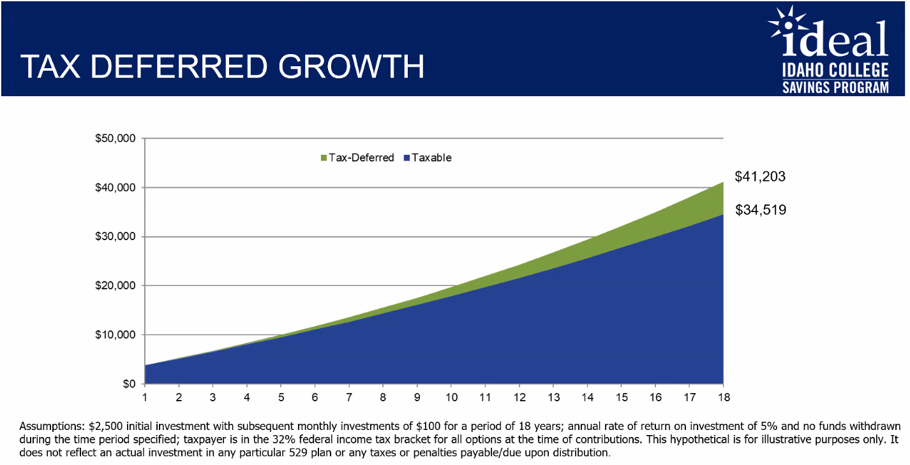
- Tax free on qualified expenses  
  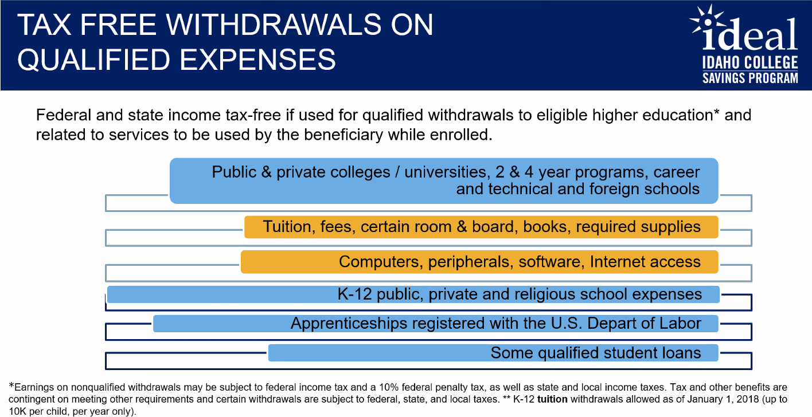  
  - Max $10, 000 on *qualified* student loans

## Contributions
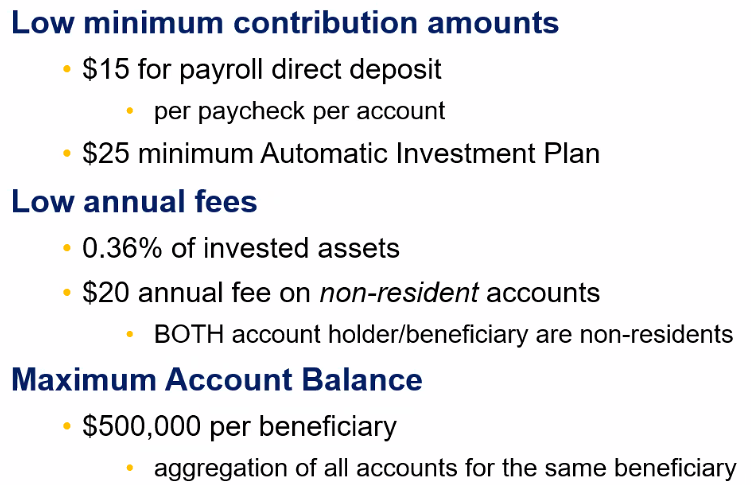  
- 0.36(Total ROI Per Day)
  5.36% return on investment on one day
  Total return for the day is 5.00%

## Participation
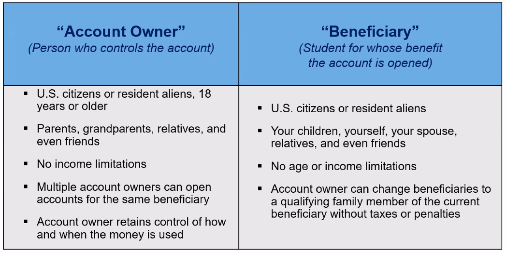  
### Account Owner
### Beneficiary

## Left Over Funds
- Let it grow
- Change beneficiary
- Rollover to Roth IRA (Maximum of $35, 000)
- Taxable withdrawal  
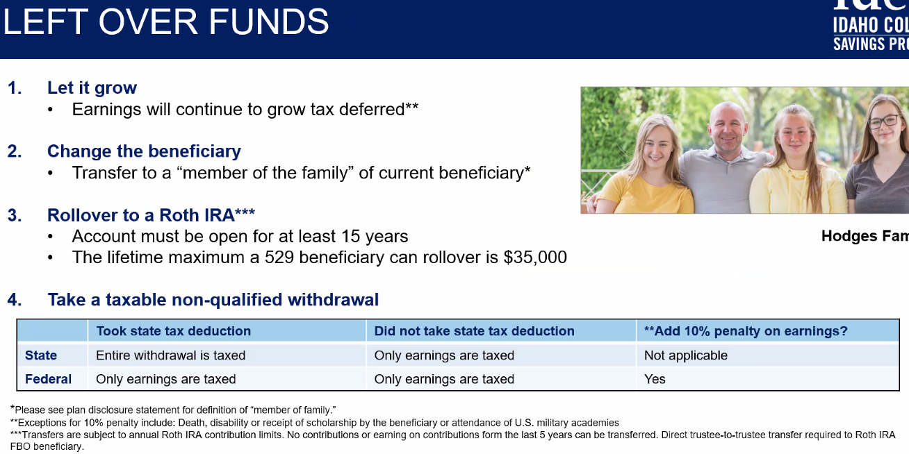

## Investments
### Target Enrollment Portfolios
Based on a date, the investment strategy goes from aggressive to conservative  
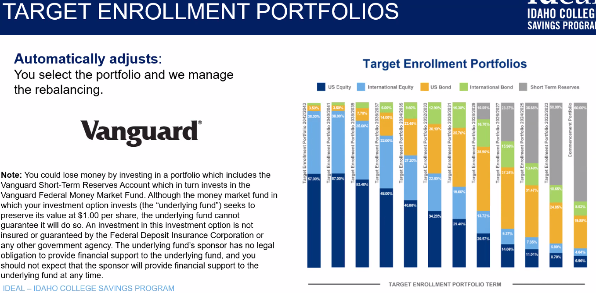

### Fixed Asset Options
- Two investment changes per year
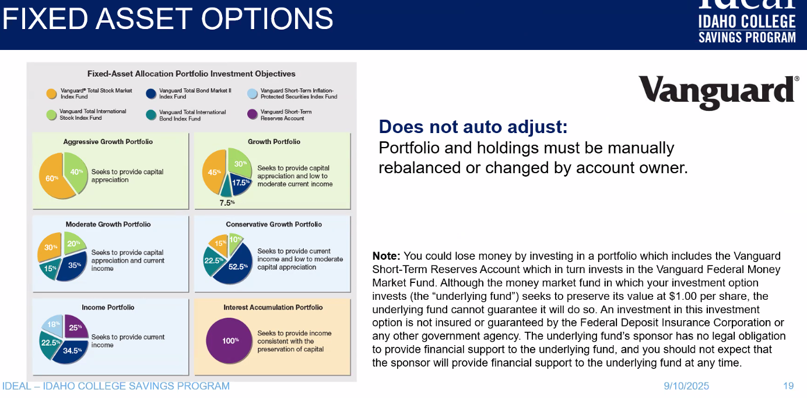

### FDIC Insured Savings Portfolio
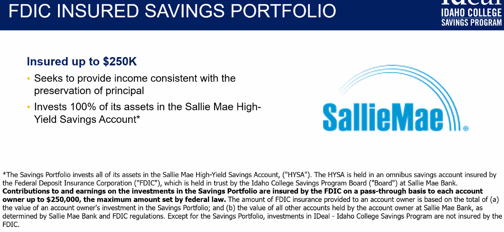

## Gifting
- UGift, anybody that contributes using UGift gets the tax deduction
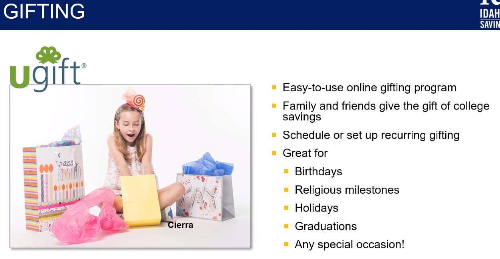

## Getting Started
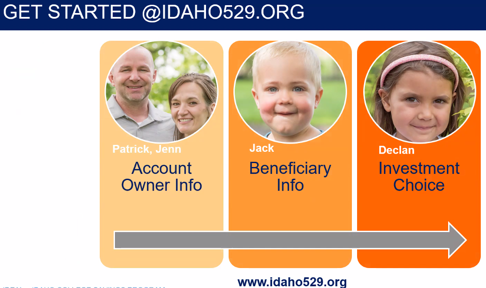

### Payroll Deduction
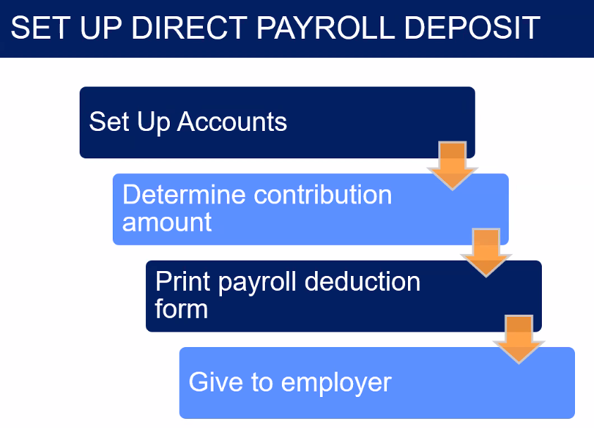

## Contact
- Nickolas.Thiros@idaho529.org
- [Make Appointment with Nick](https://outlook.office.com/book/NickThiros@ascensus.com/?ismsaljsauthenabled)
